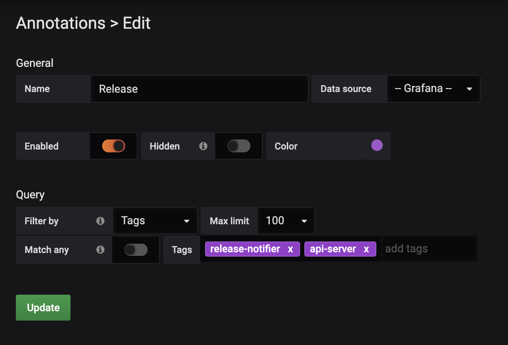
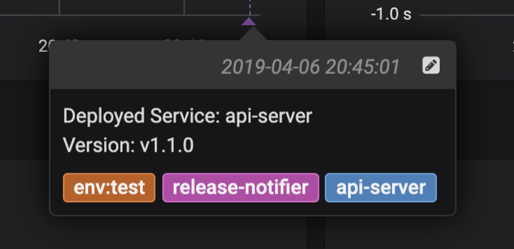

# Grafana Release Notifier

- [Grafana Release Notifier](#grafana-release-notifier)
  - [Description](#description)
  - [Configuration](#configuration)
  - [Usage](#usage)
  - [License](#license)

## Description

Simple tool that publishes release annotations on Grafana

## Configuration

The following environment variables are expected to be set

| Name          | Description                                     |
| ------------- | ----------------------------------------------- |
| GRAFANA_TOKEN | The API Token used to authenticate with Grafana |
| GRAFANA_ADDR  | The Address of the Grafana API                  |

## Usage

```
grafana-notifier <env> <app_name> <version>

## basic example
grafana-notifier production api-server 1.1.0
```

This will create an annotation in Grafana that can be added to a dashboard by
adding an annotation with the following tags:
- `release-notifier`
- `api-server`



The annotation will then look like this:



## License

MIT
